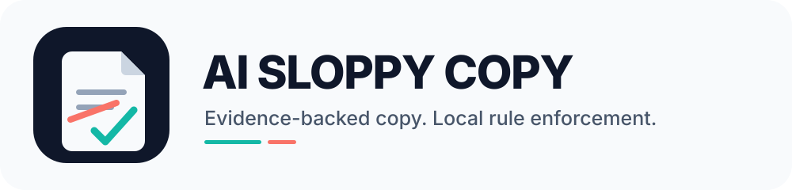
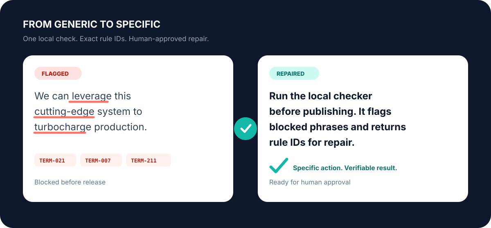
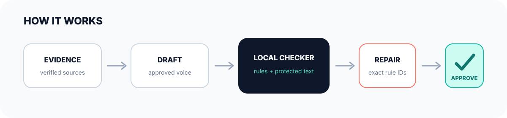

<h1 align="center">
  <picture>
    <source media="(prefers-color-scheme: dark)" srcset="plugins/ai-sloppy-copy/assets/logo-dark.svg">
    <source media="(prefers-color-scheme: light)" srcset="plugins/ai-sloppy-copy/assets/logo.svg">
    
  </picture>
</h1>

<p align="center">
  Copy guardrails for Codex: verify the claim, protect exact text, match the
  approved voice, and stop blocked phrasing before release.
</p>

<p align="center"><a href="https://github.com/plotdevice01/ai-sloppy-copy/actions/workflows/validate.yml"></a> <a href="https://github.com/plotdevice01/ai-sloppy-copy/releases/latest"></a> <a href="LICENSE"></a>  </p>

<p align="center">
  <a href="#install">Install</a> ·
  <a href="#see-it-work">Example</a> ·
  <a href="#what-it-enforces">Rules</a> ·
  <a href="#use-the-checker-directly">CLI</a> ·
  <a href="#privacy-and-security">Security</a>
</p>

AI Sloppy Copy is a Codex plugin and deterministic local checker. It catches
prohibited model-written patterns, applies evidence and voice controls, and
returns exact rule IDs for repair. The operator keeps final approval.

It does **not** identify who wrote text or promise AI-detector results. Rule
compliance and authorship are different questions.

## See it work



```text
Input
We can leverage this cutting-edge system to turbocharge production.

Hard failures
TERM-021  leverage
TERM-007  cutting-edge
TERM-211  turbocharge

Repair
Run the local checker before publishing. It flags blocked phrases and returns
rule IDs for repair.
```

The checker reports the problem. It does not perform reckless global
replacement or silently change protected text.

## What it enforces

| Control | Result |
| --- | --- |
| Evidence gates | Unsupported recommendations, testimonials, case studies, and claims require a verified basis. |
| Approved voice | Named-person copy requires owner-approved voice samples. |
| Protected text | Quotes, code, commands, paths, IDs, legal text, and required vendor wording stay exact. |
| Hard rules | Banned terms and prohibited expressions block release. |
| Review rules | Context-dependent style flags stay visible for human judgment. |
| Authorship boundary | Compliance is never presented as proof of human authorship. |

| Included coverage | Count |
| --- | ---: |
| Term rules | 288 |
| Expression rules | 21 |
| Style rules | 34 |
| Regression cases | 64 |
| Checker network calls | 0 |

## Install

You need [Codex](https://developers.openai.com/codex/) with plugin support and
[Python 3](https://www.python.org/downloads/). No repository clone, local path,
or checksum ceremony is required.

### 1. Add the marketplace and plugin

Open a terminal. Windows users can use PowerShell or the Codex terminal. Run
each command once:

```powershell
codex plugin marketplace add plotdevice01/ai-sloppy-copy
codex plugin add ai-sloppy-copy@ai-sloppy-copy
```

If Codex says the marketplace already exists, update it:

```powershell
codex plugin marketplace upgrade ai-sloppy-copy
```

### 2. Restart and trust the hooks

1. Restart Codex or start a new `codex` session.
2. Open `/hooks`.
3. Review and trust the `UserPromptSubmit` and `Stop` hooks from
   `ai-sloppy-copy`.
4. Start a new Codex task.

### 3. Confirm the install

```powershell
codex plugin list --json
```

Confirm `ai-sloppy-copy@ai-sloppy-copy` is installed and active. Then ask:

> Use AI Sloppy Copy to revise this text: We can leverage this cutting-edge
> system to turbocharge production.

The response should replace the flagged phrases with specific wording. If the
plugin is missing, repeat step 1 and restart Codex. Do not copy plugin files
into application folders manually.

## How it works



The Codex skill applies the writing contract. Lifecycle hooks inspect prompts
and completed responses. The Python checker handles repeatable file scans.
Protected text and human approval remain explicit boundaries.

## Use the checker directly

The checker uses only the Python standard library:

```powershell
python plugins/ai-sloppy-copy/scripts/ai_sloppy_copy.py `
  --rules plugins/ai-sloppy-copy/scripts/AI-Sloppy-Copy-Rules.json `
  path/to/draft.docx
```

Supported inputs: TXT, Markdown, CSV, JSON, HTML, XML, and DOCX.

- Exit code `0`: no hard violations.
- Exit code `1`: one or more hard violations.

## Update or remove

Update:

```powershell
codex plugin marketplace upgrade ai-sloppy-copy
codex plugin remove ai-sloppy-copy
codex plugin add ai-sloppy-copy@ai-sloppy-copy
```

Remove:

```powershell
codex plugin remove ai-sloppy-copy
codex plugin marketplace remove ai-sloppy-copy
```

## Chief of Staff stack

AI Sloppy Copy is also included in the recommended
[Codex Chief of Staff](https://github.com/plotdevice01/codex-chief-of-staff)
installation. Its guide installs the complete companion stack in order.

## Privacy and security

The checker runs locally. The plugin has no connectors, accounts, telemetry, or
network calls. Its hooks receive Codex hook data and write only a temporary
per-session retry counter.

Do not put secrets or private client text into custom rule datasets. Report a
security issue through
[GitHub private vulnerability reporting](https://github.com/plotdevice01/ai-sloppy-copy/security/advisories/new).

See [SECURITY.md](SECURITY.md) for the support policy.

## Development

```powershell
python tests/test_runtime.py
python scripts/build_release.py
```

Every tagged release produces a deterministic portable ZIP. The release archive
contains the same plugin, rules, documentation, and visual assets as this
repository.

See [CONTRIBUTING.md](CONTRIBUTING.md),
[CHANGELOG.md](CHANGELOG.md), and
[THIRD-PARTY-NOTICES.md](THIRD-PARTY-NOTICES.md).

## License

[MIT](LICENSE). Third-party source notices and licenses are listed in
[THIRD-PARTY-NOTICES.md](THIRD-PARTY-NOTICES.md).
